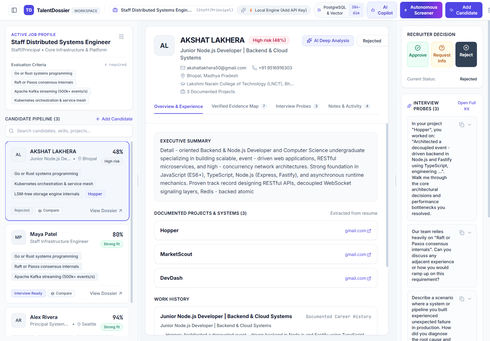
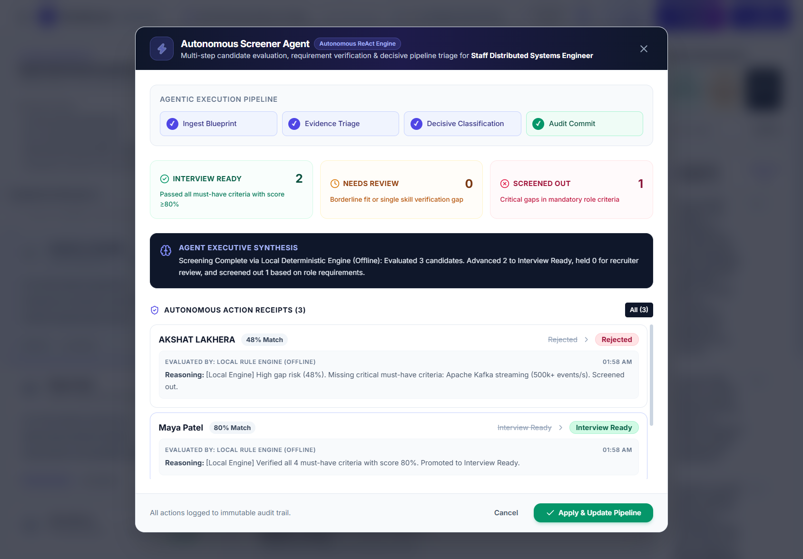
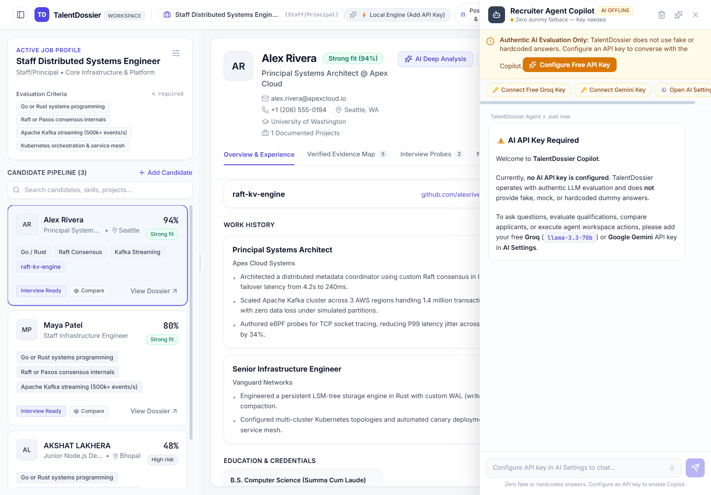
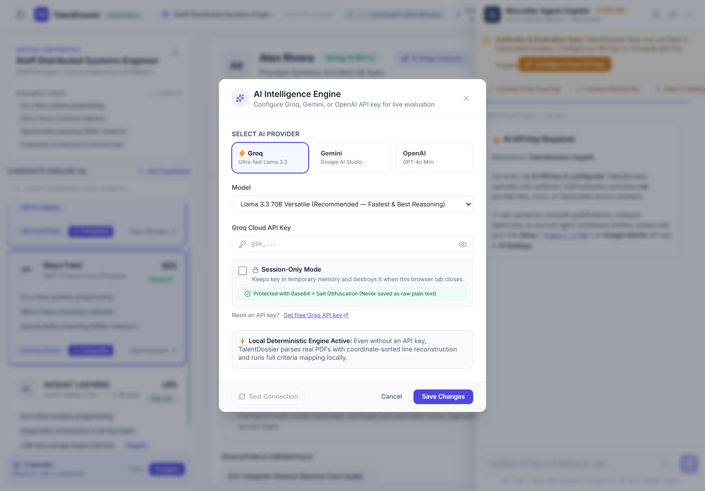

# TalentDossier (TD) — Autonomous AI Recruiter Intelligence System
> **Built for the Agentic AI Hackathon 2026**  
> *Autonomous Candidate Screening, Evidence Verification & Workspace Tool Execution*

[](https://github.com/akshat-lakhera/hireflow-ai/actions/workflows/ci.yml)
[](https://github.com/akshat-lakhera/hireflow-ai/actions/workflows/deploy.yml)

TalentDossier is an **Autonomous Agentic Recruiting Platform** engineered to transform raw applicant resumes into verifiable, evidence-grounded hiring decisions. Operating on a **ReAct (Reasoning + Acting) Agentic Framework**, TalentDossier gives AI real agency over the recruiter's workspace: autonomously evaluating applicant portfolios against custom role blueprints, executing UI tools (comparison matrix, stage updates, interview kits), and committing auditable decisions directly into an IndexedDB / Supabase pgvector store.

---

## Workspace Showcase

### 1. Three-Column Recruiter Workspace
A responsive, resizable IDE-style workspace with pipeline cards, deep-dive executive dossier, verified citations, and recruiter action rail.



---

### 2. Autonomous Screener Agent (Multi-Step ReAct Pipeline)
Autonomously ingests the role requirements, performs evidence triage, makes decisive stage classifications (`Interview Ready`, `Needs Review`, `Rejected`), and logs immutable audit trails.



---

### 3. Recruiter Agent Copilot (Workspace Tool Execution)
Natural language RAG recruiter agent that reasons over applicant data and directly executes workspace actions with visual execution receipts.



---

### 4. Head-to-Head Candidate Compare Matrix
Benchmarking matrix evaluating two candidates side-by-side across match scores, experience, and differential technical requirements.



---

## Agentic Core Features

### 1. Autonomous Screener Agent
- **4-Step Execution Pipeline**:
  1. `Ingest Blueprint`: Loads role criteria, must-have skills, and dense 384-dimensional candidate embeddings.
  2. `Evidence Triage`: Verifies qualification coverage across projects, work history, and verified proof points.
  3. `Decisive Classification`: Autonomously advances candidates to **Interview Ready**, holds for **Needs Review**, or screens out to **Rejected**.
  4. `Audit Commit`: Writes timestamped justification notes and immutable audit trail records directly to candidate files.
- **Dual-Engine Transparent Attribution**:
  - *Frontier LLM Mode*: Uses Groq (`llama-3.3-70b-versatile`), Google Gemini (`gemini-1.5-flash`), or OpenAI (`gpt-4o-mini`) to generate authentic, non-templated reasoning.
  - *Local Deterministic Rule Engine*: Client-side verification fallback with 100% honest attribution (zero fabricated claims).

### 2. Recruiter Agent Copilot (7 Workspace Tools)
The Copilot is equipped with active agency through executable workspace tools:
1. `compare_candidates`: Opens side-by-side comparison matrix for designated applicants.
2. `update_candidate_status`: Promotes or rejects candidates in real time.
3. `select_candidate`: Loads the candidate's executive dossier into the workspace.
4. `open_interview_kit`: Launches the technical interview kit with confidential rubrics.
5. `add_note`: Appends recruiter intelligence notes to the candidate's permanent file.
6. `filter_pipeline`: Filters candidates by keyword or skill in real time.
7. `autonomous_screen_pipeline`: Dispatches the multi-step screener agent.
- **Visual ReAct Receipts**: Each tool call renders an interactive receipt badge in the chat stream displaying the agent's thought process, tool name, parameters, and live UI status.

### 3. Structured Interview Kit with TTS & Speech-to-Text
- **Confidential Rubric Protection**: Text-to-Speech (TTS) speaks only the interview question aloud, never leaking interviewer rubrics or internal scoring criteria.
- **Live Voice Dictation (STT)**: Web Speech API integration captures interviewer notes and candidate answers in real time.
- **Auto-Synced Answer Persistence**: Answers and interviewer evaluations persist directly to the database.

### 4. Dual-Layer Storage & Hybrid Vector Engine
- **Local IndexedDB Vector Store**: Zero setup required. Every candidate is automatically embedded into a 384-dimensional dense vector space for sub-millisecond semantic search.
- **Supabase Cloud Sync (pgvector)**: Enterprise database support with automated background sync, vector similarity search (`match_candidates` RPC), and schema migration script (`public/schema.sql`).
- **Zero Data Loss Guarantee**: Automatic migration ensures candidate records and role configurations remain intact across updates.

---

## System Architecture

```
                               ┌─────────────────────────────────────────┐
                               │         TalentDossier Front-End         │
                               │   (React 19 + TypeScript + Vite + CSS)  │
                               └────────────────────┬────────────────────┘
                                                    │
                 ┌──────────────────────────────────┴──────────────────────────────────┐
                 ▼                                                                     ▼
   ┌───────────────────────────┐                                         ┌───────────────────────────┐
   │    Local Storage Layer    │                                         │    Frontier AI Engine     │
   ├───────────────────────────┤                                         ├───────────────────────────┤
   │ • IndexedDB Vector Store  │                                         │ • Groq LLaMA 3.3 70B      │
   │ • 384-dim Dense Vectors   │                                         │ • Google Gemini 1.5 Flash │
   │ • Cosine Similarity Engine│                                         │ • OpenAI GPT-4o-mini      │
   │ • Persistent Local Config │                                         │ • ReAct Workspace Tools   │
   └─────────────┬─────────────┘                                         └─────────────┬─────────────┘
                 │                                                                     │
                 ▼                                                                     ▼
   ┌───────────────────────────┐                                         ┌───────────────────────────┐
   │    Cloud Database Sync    │                                         │   Interview Intelligence  │
   ├───────────────────────────┤                                         ├───────────────────────────┤
   │ • Supabase PostgreSQL     │                                         │ • Web Speech STT Audio    │
   │ • pgvector 384-dim Embed  │                                         │ • SpeechSynthesis TTS     │
   │ • Hybrid Search RPC       │                                         │ • Confidential Rubrics    │
   └───────────────────────────┘                                         └───────────────────────────┘
```

---

## Quick Start

### Prerequisites
- Node.js 18+ (Node 20+ recommended)
- npm or pnpm

### Installation

```bash
# Clone the repository
git clone https://github.com/akshat-lakhera/hireflow-ai.git
cd hireflow-ai

# Install dependencies
npm install

# Start local development server
npm run dev
```

The application will be running at `http://127.0.0.1:5173/`.

### Production Build

```bash
npm run build
npm run preview
```

### Linting & Type Checking

```bash
npm run lint
npx tsc -b
```

---

## Submission Details
- **Project Name**: TalentDossier (TD)
- **Repository**: [https://github.com/akshat-lakhera/hireflow-ai](https://github.com/akshat-lakhera/hireflow-ai)
- **Hackathon Track**: Agentic AI Hackathon 2026
- **Architecture**: Autonomous Multi-Agent Recruiter System with ReAct Tool Execution & Vector Search
